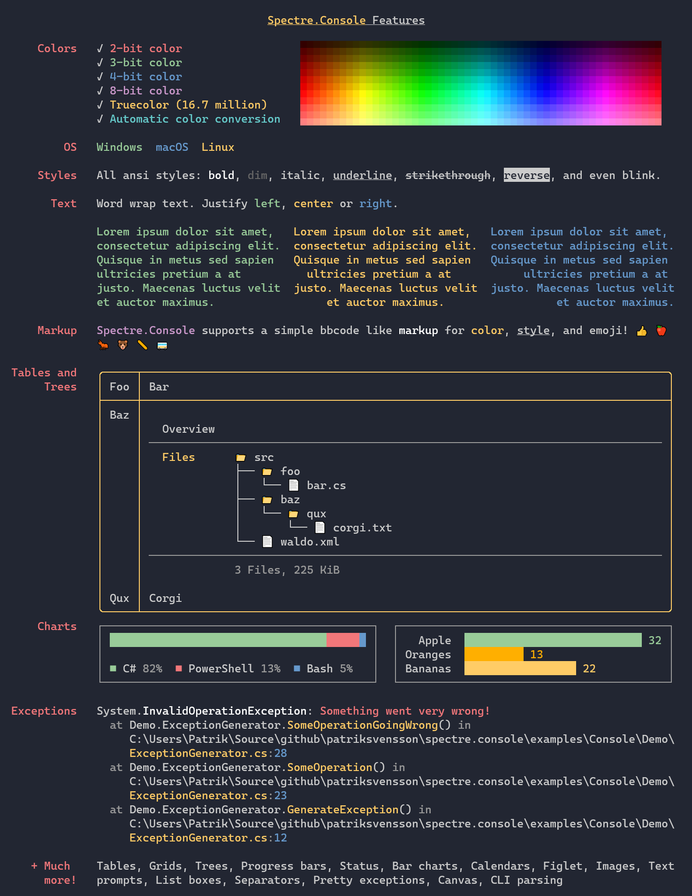
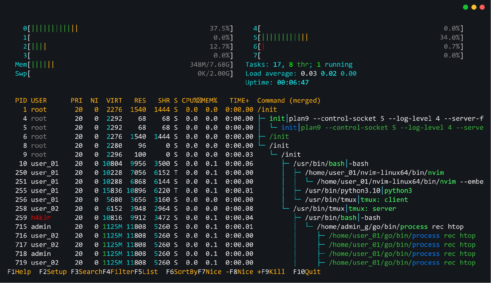
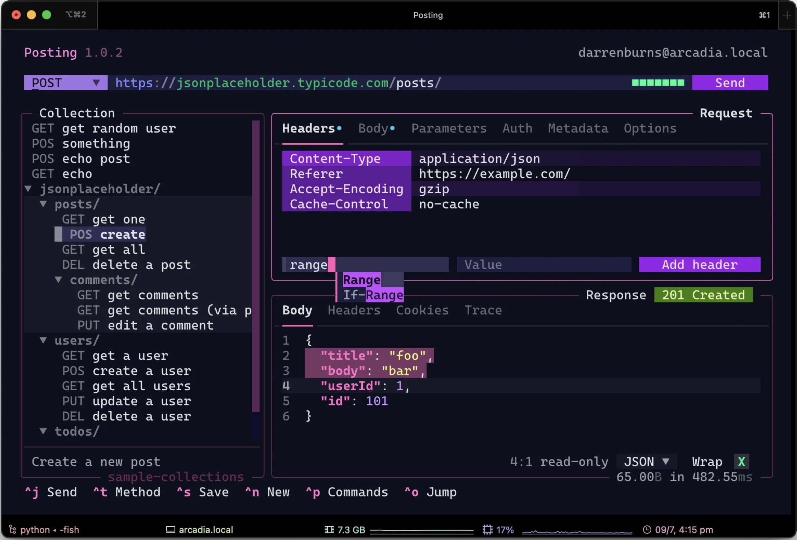

# Specs Creator CLI


## App Description

Is a Local CLI in Python tool that generates the boilerplate using http://start.spring.io/ to create the Spring Code base code. The CLI lets you choose the package manager of preference, Spring versions and Spring dependencies. The CLI took test the build of the app and then once the code is built, it will continue asking for Swagger Specs, like endpoints and sample JSON request and response to create the models for the Swagger API annotations and publishing.

## Features
- Local CLI tool that looks clean but futuristic in Python using Textual (for menus and drop down options) and Rich (for coloring and highlights) libraries.
- Guides the user to auto-generate the boilerplate code for the Spring Web application and Swagger Specs in it using Swagger API annotations.
- The Swagger specs contain request and response objects created based on provided sample JSON files, one for request and one for response.
- The code is output into a specified directory that contains a git repository already initialized.
- The CLI lets you choose from the available Spring versions, Java versions and package manager (maven or gradle)
- Embedded Actuator and Swagger API dependency to read the dependency directly from the generated API.
- Added Hibernate annotations in the request model based on input specs.
- Auto-generated unit test on the Spring Application, controller and Models with hibernate that contains different scenarios.

## CLI Flow (interactive menu)
1. Prompt for app name, Maven/Gradle module and package name
2. Ask for build tool (Maven or Gradle)
3. Select Spring Boot version and dependencies (will show a menu of available from Spring io)
4. Input json request and response directory
5. Generate Spring Boot app and print output path

## Tech Stack
- Python
    - Textual
    - Rich
- Spring IO Starter to fetch the dependencies, versions and Spring boiler plate code

## Generate Package
- `src/main/java/{package name}/controller/UserController.java`
- `src/main/java/{package name}/model/UserRequest.java`
- `src/main/java/{package name}/model/UserResponse.java`
- `src/main/java/{package name}/AppNameApplication.java`
- `src/test/java/{package name}/...`

## Inputs and Outputs
- In: User decisions based on a menu displayed in the CLI to the user
  - Status Codes for REST, gRPC, GraphQL

```http request
POST /api/v1/users HTTP/1.1
Host: localhost:8080
Content-Type: application/json
Accept: application/json

{
    "firstName": "John",
    "lastName": "Doe",
    "age": 30,
    "address": {
        "streetAddress": "123 Main St",
        "city": "Anytown",
        "state": "CA",
        "postalCode": "12345"
    },
    "phoneNumbers": [
        {
            "type": "home",
            "number": "555-555-5555"
        },
        {
            "type": "work",
            "number": "555-555-5556"
        }
    ],
    "email": "john.doe@example.com"
}
```

- In: JSON Request to be used to create the API controller request model
```json
{
    "firstName": "John",
    "lastName": "Doe",
    "age": 30,
    "address": {
        "streetAddress": "123 Main St",
        "city": "Anytown",
        "state": "CA",
        "postalCode": "12345"
    },
    "phoneNumbers": [
        {
            "type": "home",
            "number": "555-555-5555"
        },
        {
            "type": "work",
            "number": "555-555-5556"
        }
    ],
    "email": "john.doe@example.com"
}
```
- In: JSON Response to be used to create the API controller response model
```http request 
HTTP/1.1 201 Created
Content-Type: application/json

{
    "message": "User created successfully",
    "userId": "a1b2c3d4"
}
```
- Out: Spring App with Boilerplate code and Swagger API annotations in the controller and models for Swagger Specs
    - App Out:
        - Application Class with input name
        - Request and Response models with hibernate validations like (@NotBlank, @NotNull, @Valid, etc.). Also Swagger API annotations
        - Controller with Swagger API annotations from Swagger Specs

## Output Generate Specs Endpoint
- Swagger UI should be accessible at `/swagger-ui.html`
- OpenAPI JSON at `/v3/api-docs`

## Tests
- The generated code should pass the following tests:
    - Build with maven clean install or gradle clean build
    - Actuator should be available at runtime and validate the input controller endpoints
    - The Swagger API endpoints should be available and ready to consume the specs.
    - Specs should be visible via the specs endpoint.
    - Unit testing should be passing for controller, application and models with hibernate

# Sample CLIs:




